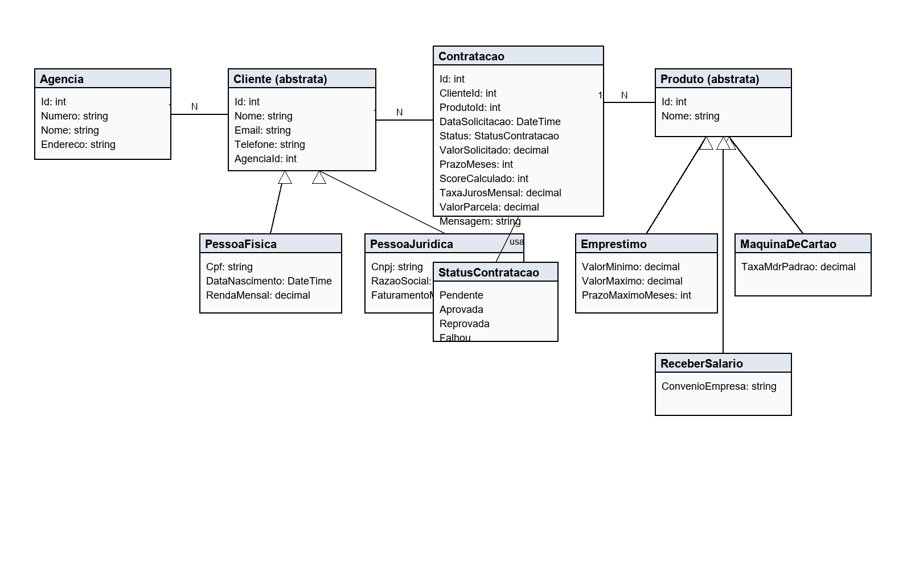
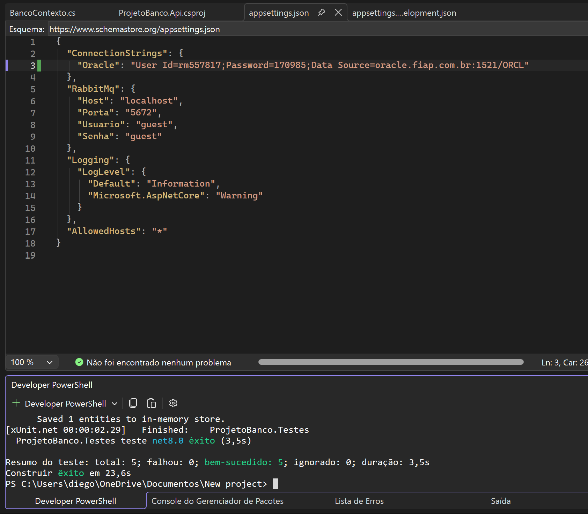
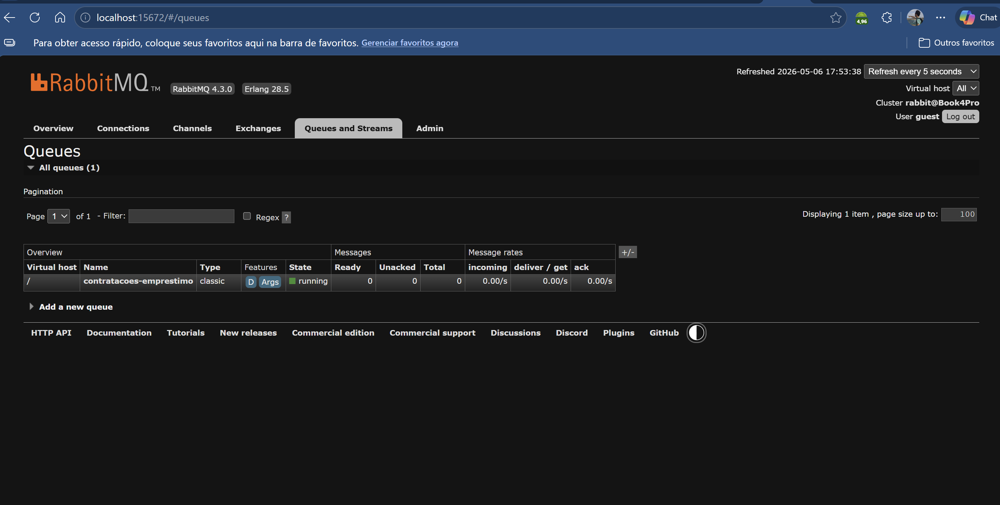
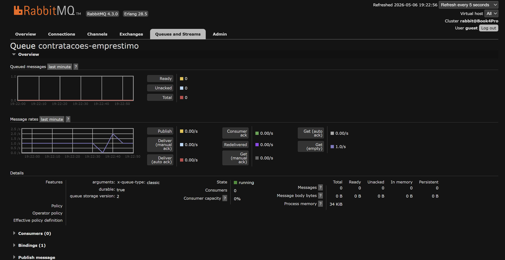
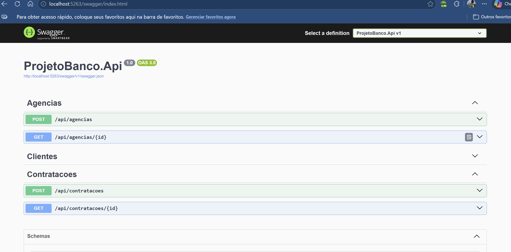
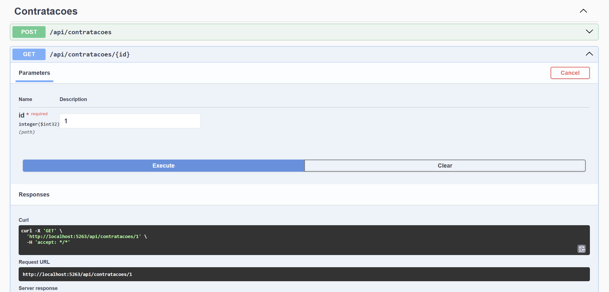
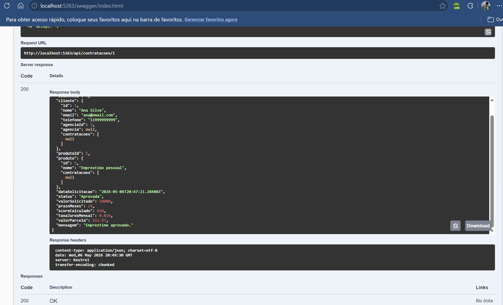
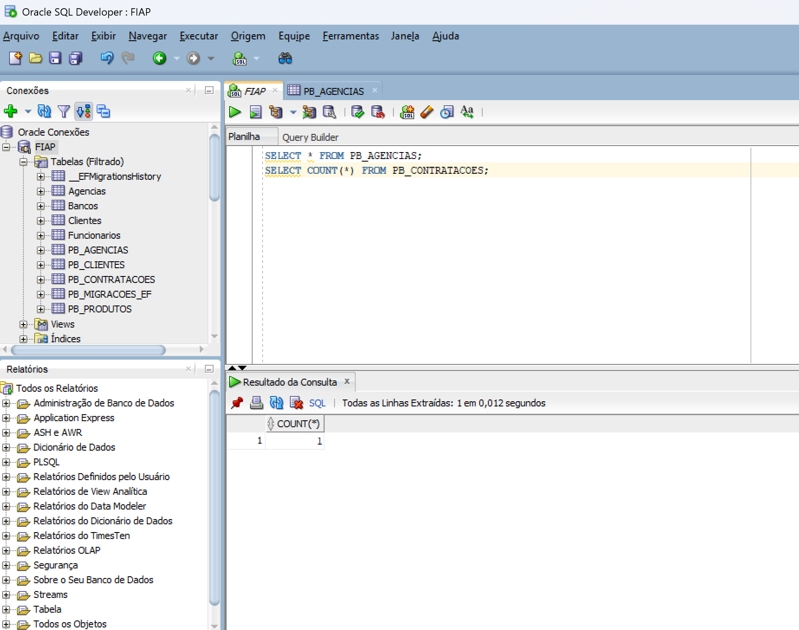

# Projeto Banco - API

## 1. Identificacao

Integrante 1: Diego Cabral - RM 557817  
Integrante 2: Debora Ivanowski - RM 555694

## 2. Produto bancario escolhido e justificativa

Produto escolhido: Emprestimo.

O emprestimo foi escolhido porque permite uma regra de negocio real e facil de demonstrar em API: o sistema calcula o score do cliente, define a taxa de juros mensal, calcula a parcela e aprova somente quando o valor da parcela fica dentro de 30% da renda analisada.

Regra extra da dupla: calculo de Score.

O score varia de 0 a 1000. Para pessoa fisica, ele considera renda mensal, idade, e-mail e telefone. Para pessoa juridica, ele considera faturamento mensal, razao social, e-mail e telefone. A contratacao de emprestimo so pode ser aprovada com score minimo de 600.

## 4. Diagrama de classes

Arquivo editavel do draw.io: [docs/diagrama-classes.drawio](docs/diagrama-classes.drawio)

Imagem do diagrama:



## 6. Endpoints disponiveis com exemplos de request/response

### POST `/api/agencias`

Request:

```json
{
  "numero": "0001",
  "nome": "Agencia Paulista",
  "endereco": "Avenida Paulista, 1000"
}
```

Response `201 Created`:

```json
{
  "id": 1,
  "numero": "0001",
  "nome": "Agencia Paulista",
  "endereco": "Avenida Paulista, 1000"
}
```

### GET `/api/agencias/{id}`

Response `200 OK`:

```json
{
  "id": 1,
  "numero": "0001",
  "nome": "Agencia Paulista",
  "endereco": "Avenida Paulista, 1000"
}
```

### POST `/api/clientes/pf`

Request:

```json
{
  "nome": "Ana Silva",
  "email": "ana@email.com",
  "telefone": "11999999999",
  "agenciaId": 1,
  "cpf": "12345678901",
  "dataNascimento": "1995-01-10",
  "rendaMensal": 9000
}
```

Response `201 Created`:

```json
{
  "id": 1,
  "nome": "Ana Silva",
  "email": "ana@email.com",
  "telefone": "11999999999",
  "agenciaId": 1,
  "cpf": "12345678901",
  "dataNascimento": "1995-01-10T00:00:00",
  "rendaMensal": 9000
}
```

### POST `/api/clientes/pj`

Request:

```json
{
  "nome": "Tech Solucoes",
  "email": "contato@tech.com",
  "telefone": "1133334444",
  "agenciaId": 1,
  "cnpj": "12345678000199",
  "razaoSocial": "Tech Solucoes Ltda",
  "faturamentoMensal": 120000
}
```

Response `201 Created`:

```json
{
  "id": 2,
  "nome": "Tech Solucoes",
  "email": "contato@tech.com",
  "telefone": "1133334444",
  "agenciaId": 1,
  "cnpj": "12345678000199",
  "razaoSocial": "Tech Solucoes Ltda",
  "faturamentoMensal": 120000
}
```

### GET `/api/clientes/{id}`

Response `200 OK`:

```json
{
  "id": 1,
  "nome": "Ana Silva",
  "email": "ana@email.com",
  "telefone": "11999999999",
  "agenciaId": 1,
  "cpf": "12345678901",
  "dataNascimento": "1995-01-10T00:00:00",
  "rendaMensal": 9000
}
```

### POST `/api/contratacoes`

Request:

```json
{
  "clienteId": 1,
  "valorSolicitado": 10000,
  "prazoMeses": 24
}
```

Response `202 Accepted`:

```json
{
  "id": 1,
  "clienteId": 1,
  "produtoId": 1,
  "status": "Pendente",
  "valorSolicitado": 10000,
  "prazoMeses": 24,
  "scoreCalculado": 0,
  "taxaJurosMensal": 0,
  "valorParcela": 0,
  "mensagem": "Contratacao recebida e enviada para analise."
}
```

### GET `/api/contratacoes/{id}`

Response `200 OK` depois do processamento:

```json
{
  "id": 1,
  "clienteId": 1,
  "produtoId": 1,
  "status": "Aprovada",
  "valorSolicitado": 10000,
  "prazoMeses": 24,
  "scoreCalculado": 820,
  "taxaJurosMensal": 0.024,
  "valorParcela": 528.71,
  "mensagem": "Emprestimo aprovado."
}
```

Erros importantes:

```json
{
  "mensagem": "CPF ja cadastrado."
}
```

```json
{
  "mensagem": "Cliente nao encontrado."
}
```

## 7. Como executar os testes e print do resultado

Comandos:

```powershell
dotnet restore
dotnet test
```

O comando `dotnet test` executa os testes automatizados do projeto `ProjetoBanco.Testes`.

Nao precisa rodar Oracle nem RabbitMQ para esses testes, porque os testes usam banco em memoria, fila em memoria e ambiente `Testes`. Dessa forma, os testes automatizados nao dependem dos servicos externos.

Resultado obtido localmente:

```text
Aprovado! - Com falha: 0, Aprovado: 5, Ignorado: 0, Total: 5
```



Fluxos cobertos:

1. Cadastro de PF e CPF duplicado.
2. Cadastro de PJ e CNPJ duplicado.
3. Cliente vinculado a agencia inexistente.
4. Contratacao valida com publicacao na fila e retorno `202 Accepted`.
5. Contratacao para cliente inexistente.
6. Consulta de status depois do processamento.

## 8. Print do painel do RabbitMQ mostrando a fila com mensagens processadas





A fila contratacoes-emprestimo aparece ativa no RabbitMQ. As mensagens estao zeradas porque foram consumidas pelo processador da API apos a contratacao.

## 9. Print da API rodando no Swagger com pelo menos uma contratacao aprovada







## 10. Evidencia de conexao com Oracle

A conexao com o banco Oracle da FIAP funcionou corretamente. A API aplicou as migrations pelo Entity Framework Core, criou as tabelas do projeto com o prefixo `PB_` e salvou os dados cadastrados pelo Swagger.

A imagem abaixo mostra a consulta feita no Oracle SQL Developer na tabela `PB_CONTRATACOES`, confirmando que a contratacao criada pela API foi persistida no banco Oracle.



## 11. Regra de negocio do emprestimo

O produto escolhido foi o emprestimo e ele utiliza duas regras de negocio:

Regra 1: calculo de score.

O score varia de 0 a 1000 e e calculado a partir dos dados do cliente. Para pessoa fisica, sao considerados renda mensal, idade, e-mail e telefone. Para pessoa juridica, sao considerados faturamento mensal, razao social, e-mail e telefone. A contratacao de emprestimo exige score minimo de 600.

Regra 2: analise e aprovacao do emprestimo.

1. Valor minimo: 500.
2. Valor maximo: 50000.
3. Prazo permitido: 6 a 48 meses.
4. Score minimo para aprovacao: 600.
5. Taxa mensal: 1,8% para score maior ou igual a 850; 2,4% para score maior ou igual a 750; 3,2% para score entre 600 e 749.
6. A parcela calculada nao pode passar de 30% da renda analisada.
7. Para PJ, a renda analisada e 20% do faturamento mensal.
